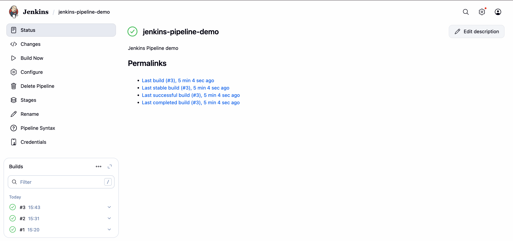
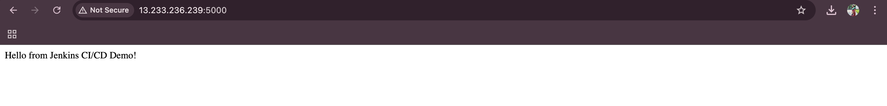

# Jenkins Pipeline Demo 🚀

A simple **CI/CD pipeline project** using **Jenkins** and **Docker** to automatically build, push, and deploy a Python web application.

---

## Project Overview

This project demonstrates:

- Building a **Docker image** from your app automatically
- Pushing the image to **DockerHub**
- Deploying the app automatically on an **EC2 Ubuntu instance**
- Secure credentials management with **Jenkins Secrets**

---

## Application

This is a small Python Flask web app that displays:

```
Hello from Jenkins CI/CD Demo!
```

---

## CI/CD Pipeline Flow

1. **Checkout**: Pull the latest code from GitHub  
2. **Build Docker Image**: Build the app image  
3. **Docker Login**: Authenticate with DockerHub  
4. **Push Docker Image**: Push the image to DockerHub  
5. **Deploy**: Stop old container (if exists) and run the new one  

---

## Jenkinsfile

```groovy
pipeline {
    agent any

    environment {
        DOCKERHUB_CREDENTIALS = credentials('dockerhub-creds')
        IMAGE_NAME = "kshitija1510/jenkins-pipeline-demo"
        IMAGE_TAG = "latest"
        CONTAINER_NAME = "jenkins-demo"
        APP_PORT = "5000"
    }

    stages {
        stage('Checkout') { steps { checkout scm } }
        stage('Build Docker Image') { steps { sh "docker build -t $IMAGE_NAME:$IMAGE_TAG ." } }
        stage('Docker Login') { steps { sh 'echo $DOCKERHUB_CREDENTIALS_PSW | docker login -u $DOCKERHUB_CREDENTIALS_USR --password-stdin' } }
        stage('Push Docker Image') { steps { sh "docker push $IMAGE_NAME:$IMAGE_TAG" } }
        stage('Deploy') {
            steps {
                sh "docker stop $CONTAINER_NAME || true"
                sh "docker rm $CONTAINER_NAME || true"
                sh "docker run -d -p $APP_PORT:$APP_PORT --name $CONTAINER_NAME $IMAGE_NAME:$IMAGE_TAG"
            }
        }
    }

    post {
        always { echo "Pipeline finished" }
        success { echo "Docker image pushed and deployed successfully!" }
        failure { echo "Pipeline failed!" }
    }
}
```

---

## Screenshot

**Jenkins Build Success**:  
  

**Application Running on EC2**:  
  

> Make sure to create a `screenshots/` folder in your repo and add these images there.

---

## DockerHub

Check out the Docker image on DockerHub:  
[https://hub.docker.com/repository/docker/kshitija1510/jenkins-pipeline-demo](https://hub.docker.com/repository/docker/kshitija1510/jenkins-pipeline-demo)

---

## How to Run Locally

1. Clone the repo:  
```bash
git clone https://github.com/Kshitija-0710/jenkins-pipeline-demo.git
cd jenkins-pipeline-demo
```

2. Build Docker image:  
```bash
docker build -t jenkins-pipeline-demo .
```

3. Run the container:  
```bash
docker run -d -p 5000:5000 jenkins-pipeline-demo
```

4. Access the app:  
```
http://<EC2_PUBLIC_IP>:5000
```

---

## Tech Stack

- Jenkins  
- Docker  
- Python Flask  
- AWS EC2  
- GitHub Actions (optional for additional CI/CD integration)

---

## License

This project is licensed under MIT License.

